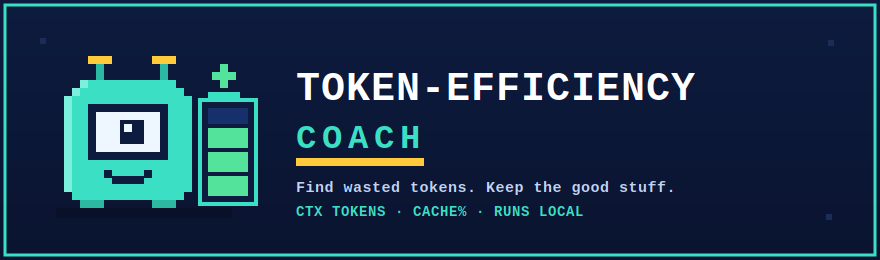
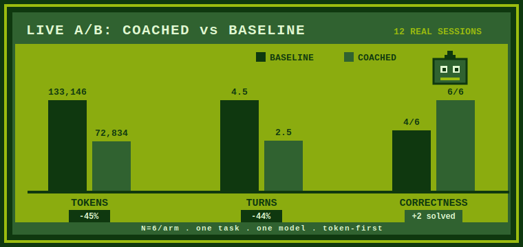
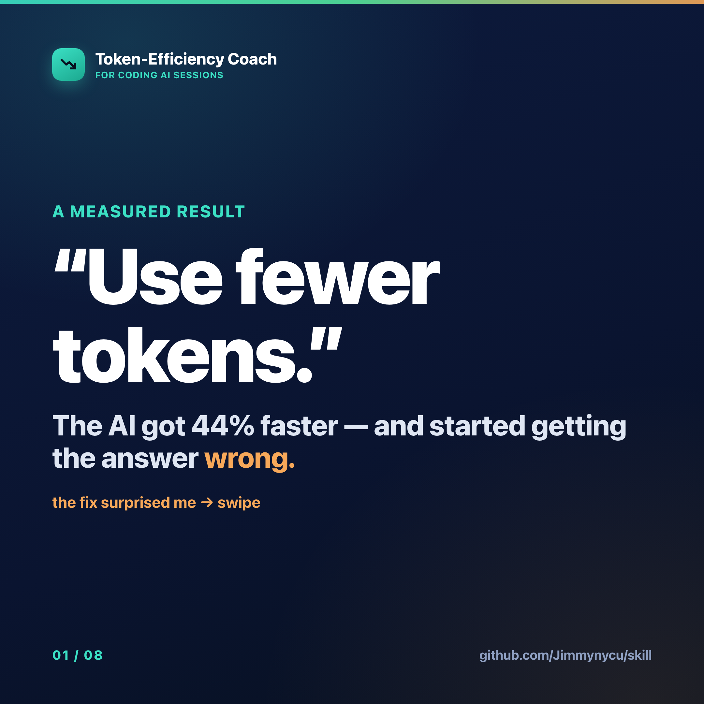
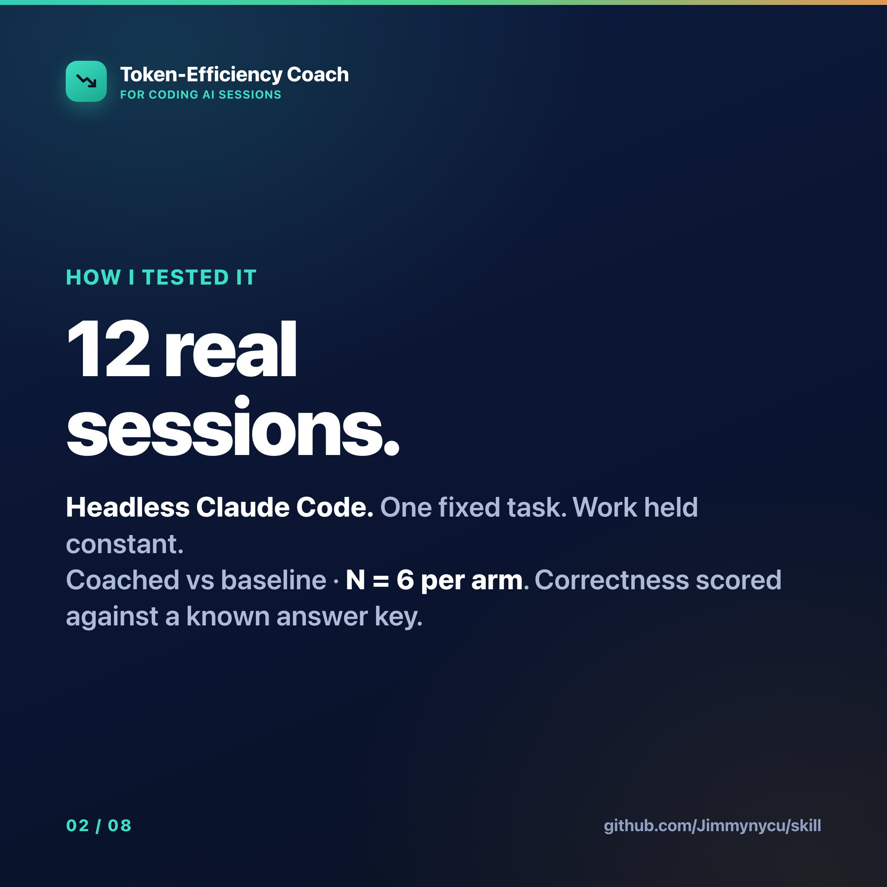
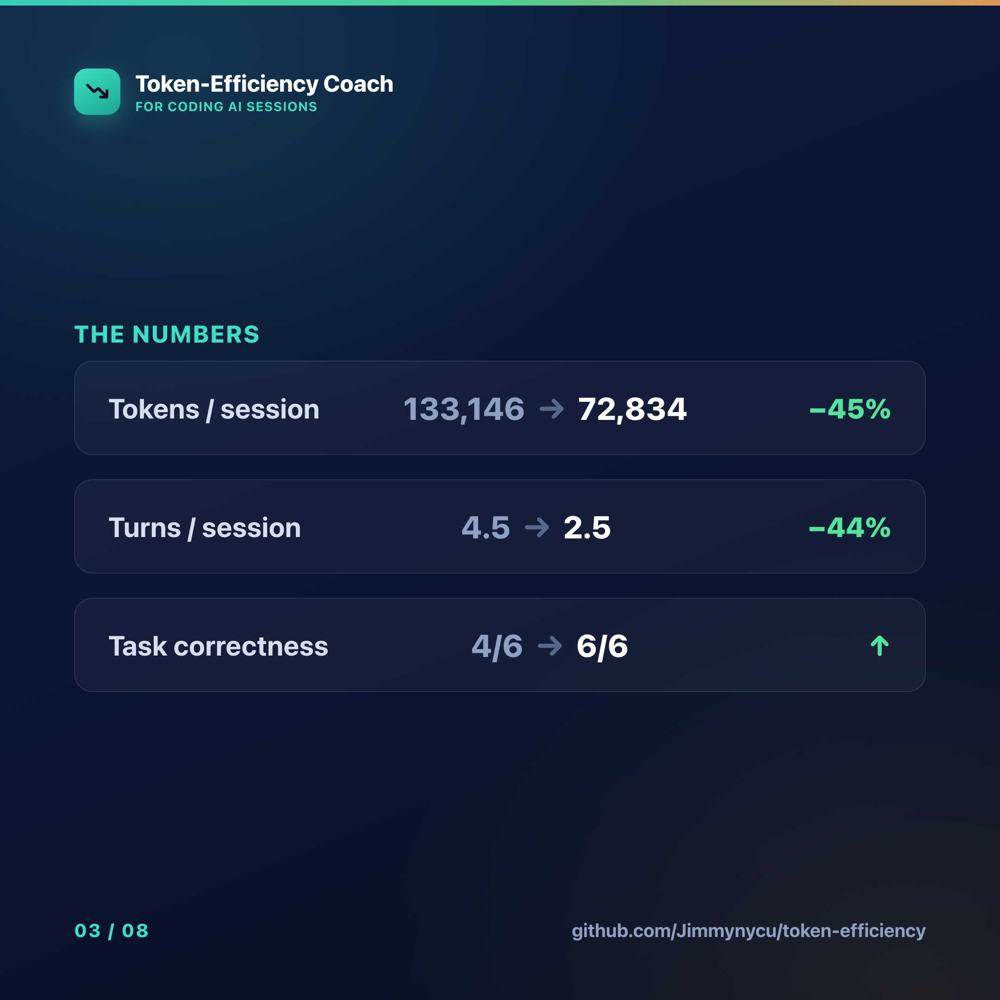
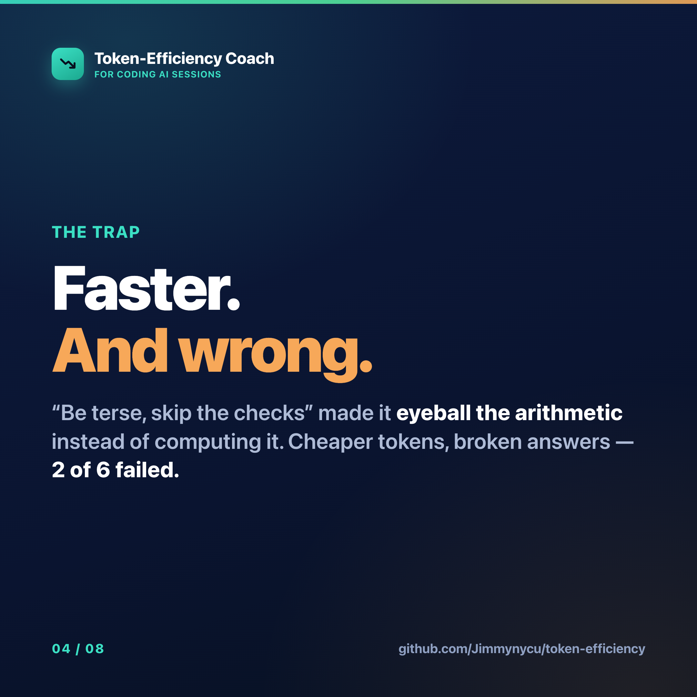
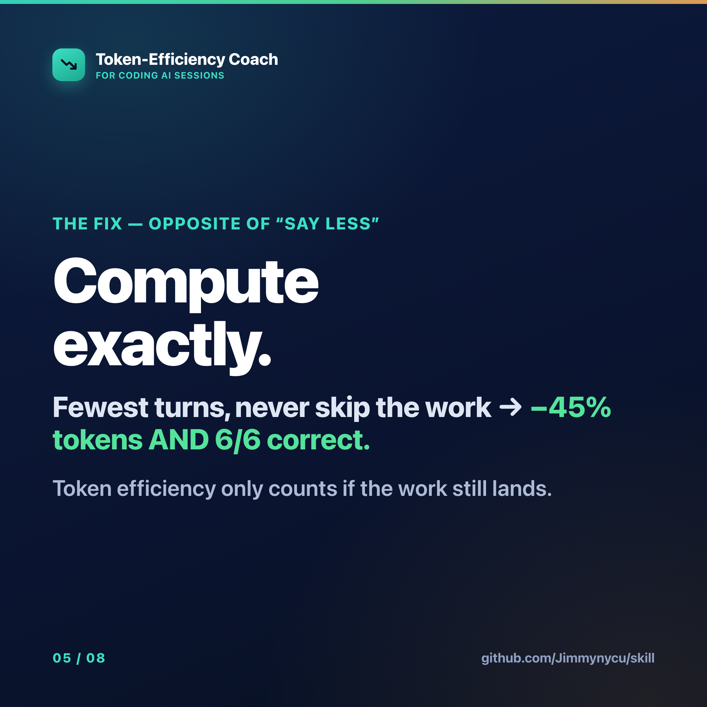
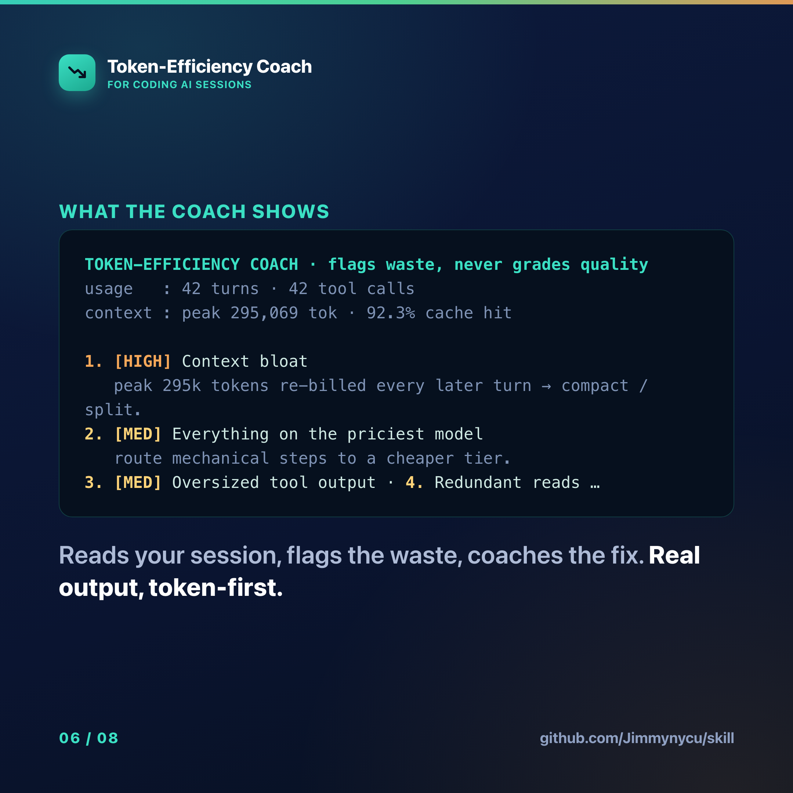
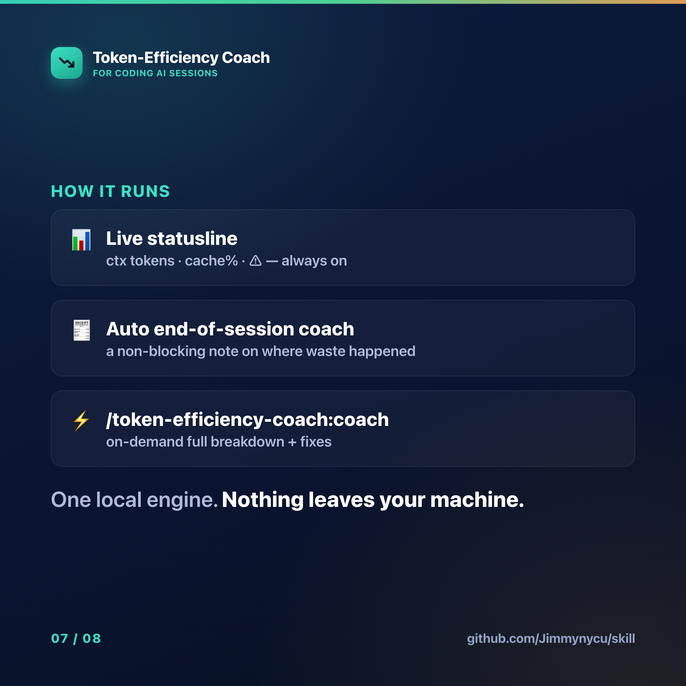
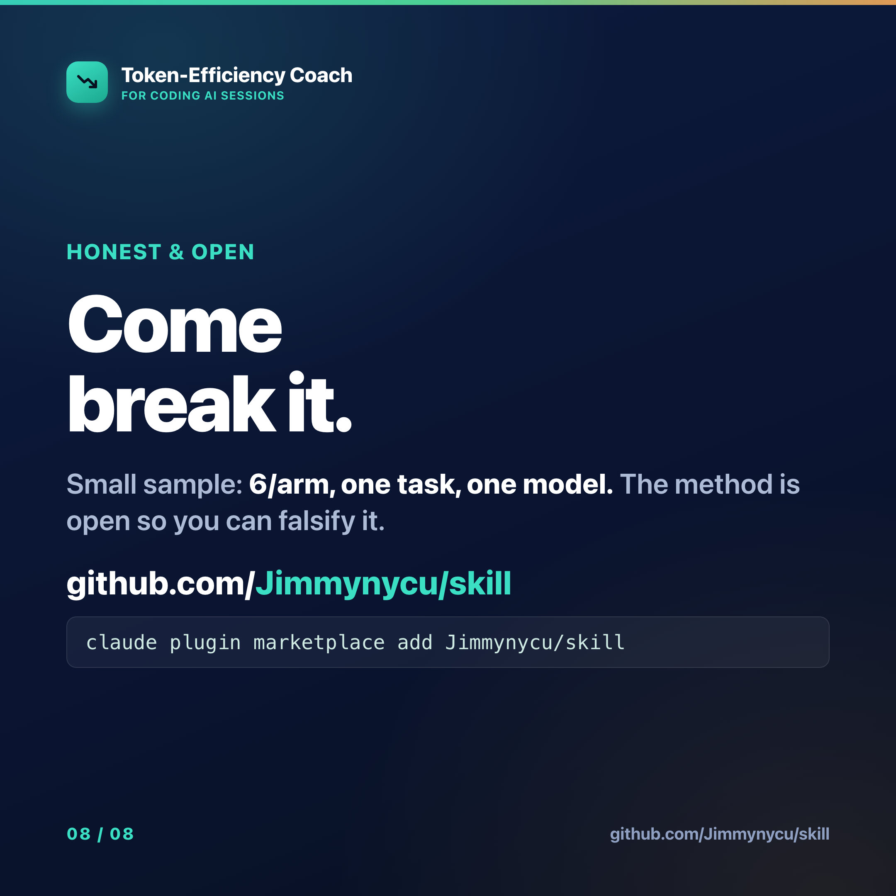

<p align="center">
  
</p>

<p align="center">
  
  
  
  
  
  <a href="https://github.com/Jimmynycu/skill/stargazers"></a>
  <a href="https://github.com/Jimmynycu/skill/releases"></a>
</p>

<p align="center">
  <b>A Claude Code plugin that shows exactly where your AI coding session wasted tokens — and how to fix it.</b>
</p>

<p align="center">
  It flags <i>waste</i>, never quality. It runs on your machine. It speaks tokens, not dollars.
</p>

<p align="center">
  <b>&minus;45% tokens&nbsp;&nbsp;·&nbsp;&nbsp;&minus;44% turns&nbsp;&nbsp;·&nbsp;&nbsp;4/6 → 6/6 correct</b><br>
  <sub>measured in a live A/B — 6 sessions per arm, 12 total &nbsp;·&nbsp; <a href="#numbers">see the method ↓</a></sub><br>
  <sub>Runs as an external local engine — <b>zero added context overhead</b> in your own session.</sub>
</p>

<p align="center">
  <a href="#install">Install</a> &nbsp;·&nbsp;
  <a href="#what-it-catches">What it catches</a> &nbsp;·&nbsp;
  <a href="#numbers">Numbers</a> &nbsp;·&nbsp;
  <a href="#the-story-in-8-slides">The story</a> &nbsp;·&nbsp;
  <a href="#how-it-works">How it works</a> &nbsp;·&nbsp;
  <a href="#faq">FAQ</a>
</p>

---

## Install

**About a minute. Two commands.** The first adds the **`jimmy-tools`** marketplace from this repo (`Jimmynycu/skill`); the second installs the plugin from it. The `@jimmy-tools` handle is the marketplace name declared in [`.claude-plugin/marketplace.json`](.claude-plugin/marketplace.json) — copy **both** lines exactly.

```sh
# 1) add the marketplace (registers as: jimmy-tools)
claude plugin marketplace add Jimmynycu/skill

# 2) install the plugin from that marketplace
claude plugin install token-efficiency-coach@jimmy-tools
```

Prefer the interactive UI? Run `/plugin marketplace add Jimmynycu/skill`, then `/plugin install token-efficiency-coach@jimmy-tools` — or just `/plugin` and pick it from **Discover**.

> [!NOTE]
> **What "runs locally" means.** The *coach* does all its analysis on your machine — no session content ever leaves. The **install step above is the one exception**: `marketplace add` fetches this repo over the network and may ask you to confirm trusting the marketplace before it registers. Once installed, nothing else phones home.

> [!TIP]
> **What you get, immediately:** a live token-first statusline (`ctx tokens · cache% · ⚠`), an automatic non-blocking coach that summarizes waste when a session ends, and an on-demand `/token-efficiency-coach:coach` you can run any time.

That's it. No API keys, no account. The coach reads your local session and talks back.

---

## What it catches

The coach scans a session for **waste** — the tokens you paid for and didn't need. It does **not** grade whether your code or answers were "good." Eight things it flags:

- **Context bloat** — the window quietly ballooning turn over turn
- **Uncached context** — paying full freight for context that could have been cached
- **Oversized tool output** — a single tool dumping a wall of tokens into the window
- **Output-heavy turns** — generation spend that ran hotter than the task needed
- **Failed tool calls** — errors you paid to send and paid to read
- **Wrong-tier routing** — a heavyweight model doing featherweight work
- **Redundant reads** — re-reading the same file the model already has
- **Very long single thread** — one sprawling session that never compacted or split

> [!NOTE]
> Every flag is a **token** flag. The coach never says "your code is bad." It says "this part cost more than it had to, here's the cheaper path."

---

## Numbers

We ran a live A/B: **6 sessions per arm, 12 real headless `claude` sessions total**, one fixed task, the actual work held constant. Coached vs. baseline:

<p align="center">
  
</p>

| Metric | Baseline | Coached | Change |
| --- | ---: | ---: | ---: |
| Mean tokens / session | 133,146 | 72,834 | **−45%** |
| Mean turns / session | 4.5 | 2.5 | **−44%** |
| Task correctness | 4 / 6 | 6 / 6 | **+2 solved (4/6 → 6/6)** |

**Why it works:** coaching collapses turns. One exact-compute step replaces a sprawl of exploratory ones — and *every* turn re-bills the cached context it carries. Fewer turns, fewer re-bills, fewer tokens.

> [!NOTE]
> **Honest caveats.**
> - **6 per arm, 12 total** — a small sample.
> - One task, one model.
> - Token-first — we did not measure wall-clock or dollars.
> - Your mileage will vary with task shape and model tier.
>
> We are showing you the experiment, not a guarantee.

---

## The story in 8 slides

The whole arc — why I almost killed this project, the experiment, and the one counter‑intuitive fix — as a read‑through carousel. **Scroll the slides below**, or open [the live swipe-through deck](https://jimmynycu.github.io/skill/carousel.html) for the swipe‑through deck (the same one posted on LinkedIn).

<p align="center"></p>

> **1 —** "Use fewer tokens." The AI got 44% faster… and started getting the answer **wrong.**

<p align="center"></p>

> **2 —** How I tested it: 12 real headless Claude Code sessions, one fixed task, work held constant, **N = 6 per arm.**

<p align="center"></p>

> **3 —** The numbers: **−45%** tokens, **−44%** turns, and correctness **up** from 4/6 to 6/6.

<p align="center"></p>

> **4 —** The trap: "be terse, skip the checks" made it **eyeball the arithmetic** instead of computing it — 2 of 6 failed.

<p align="center"></p>

> **5 —** The fix (the opposite of "say less"): **compute exactly, in the fewest turns** → −45% tokens **and** 6/6 correct.

<p align="center"></p>

> **6 —** What the coach actually prints — real output, token‑first. It flags **waste**, never quality.

<p align="center"></p>

> **7 —** Three surfaces, **one local engine**: live statusline, auto end‑of‑session coach, on‑demand command.

<p align="center"></p>

> **8 —** Come break it: small sample, open method — so you can falsify it. Install is **two commands**.

---

## How it works

Three surfaces. **One engine.** The same local analyzer powers all of them — so the statusline, the end-of-session note, and the on-demand command always agree.

| Surface | When it fires | What it shows |
| --- | --- | --- |
| **Statusline** | Always, live | `ctx tokens · cache% · ⚠` — token-first, at a glance |
| **SessionEnd hook** | Automatically, on session end | A short, **non-blocking** coaching note: where waste happened |
| **`/token-efficiency-coach:coach` command** | On demand | A full breakdown of the current session's waste + concrete fixes |

```
       ┌──────────────────────────────────────────┐
       │             one local engine             │
       │  (parses your session, scores the waste) │  → no network
       └──────────────────────┬───────────────────┘
                              │
      ┌───────────────────────┼───────────────────────────┐
      ▼                       ▼                            ▼
  statusline            SessionEnd hook        /token-efficiency-coach:coach
 (live, always)        (auto, non-blocking)             (on demand)
```

---

## Commands

| Command | What it does |
| --- | --- |
| `/token-efficiency-coach:coach` | Analyze the current session and print where tokens were wasted, with fixes |
| *(SessionEnd hook)* | Runs itself — no command. Prints a short coaching note when a session ends. Never blocks. |
| *(statusline)* | Always on once installed. Shows `ctx tokens · cache% · ⚠` in your status bar. |

---

## FAQ

**Does it send my code anywhere?**
No. Everything runs locally on your machine. No prompt, no code, no session content ever leaves. There is no server to send it to.

**Will the SessionEnd hook slow me down or block my work?**
No. It's non-blocking by design — it prints a short note as a session ends and gets out of the way. If it ever can't run, your session ends exactly as it would have anyway.

**Does it grade the quality of my code?**
Never. The coach only looks at **token waste** — bloat, uncached context, oversized or failed tool calls, wrong-tier routing, redundant reads. Whether the work was good is your call, not the coach's.

**Why tokens and not dollars?**
Tokens are the thing you actually control turn to turn; dollar prices drift and differ per plan. Optimize the tokens and the bill follows. Token-first keeps the signal honest.

**Do I need an API key or an account?**
No. Install the plugin and it works. The engine reads your local session data directly.

---

## License

[MIT](LICENSE). Use it, fork it, ship it.

<sub>Retro pixel art and the coach mascot are original work for this project — inspired by the early-handheld era, not copied from it.</sub>
